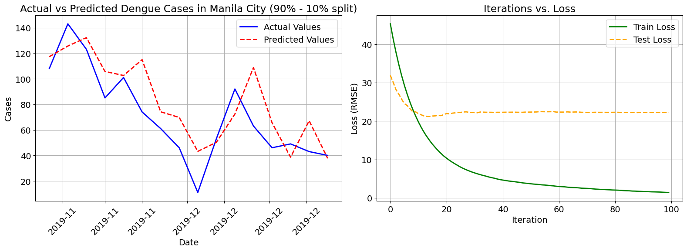
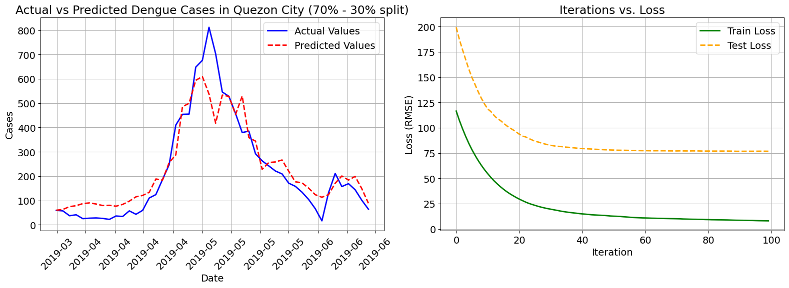
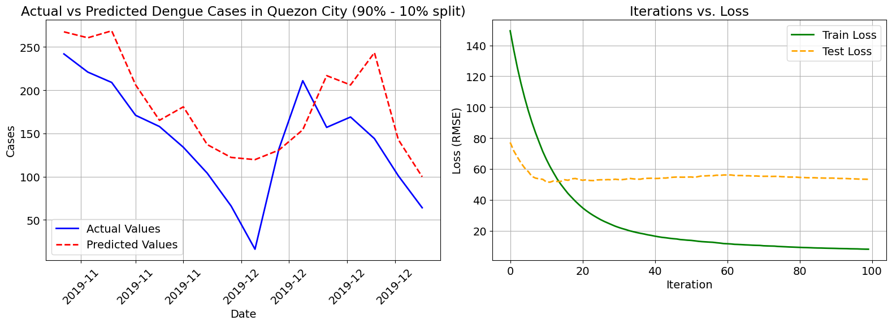

# Dengue Case Forecasting using XGBoost

This project models the time series data of dengue cases in Manila City and Quezon City using XGBoost. Lagged values were used as features, and an iterative forecasting function was implemented to predict future cases.

## Methodology
1. **Data Preparation**: 
   - Historical dengue case data was preprocessed.
   - Lagged values were created as features.
2. **Model Training**:
   - The dataset was split into training and testing sets using different train-test ratios (70-30, 80-20, 90-10).
   - XGBoost was trained to predict dengue cases based on lagged features.
3. **Forecasting**:
   - An iterative forecasting function was implemented to generate multi-step predictions.
4. **STL Decomposition**:
   - Seasonal-Trend decomposition using LOESS (STL) was performed to analyze the components of the time series.

## Figures
The following figures are included in the `Figures/` folder:

- **Model Fit on Test Set**:
  - **70-30 Split (Manila City)**
    
  - **80-20 Split (Manila City)**
    
  - **90-10 Split (Manila City)**
    
  - **70-30 Split (Quezon City)**
    
  - **80-20 Split (Quezon City)**
    
  - **90-10 Split (Quezon City)**
    

- **Forecasting Results**:
  - **Forecasted Dengue Cases (Manila City)**
    
  - **Forecasted Dengue Cases (Quezon City)**
    

- **STL Decomposition**:
  - **STL Decomposition (Manila City)**
    
  - **STL Decomposition (Quezon City)**
    

## Future Work
- Improve feature engineering by incorporating weather and environmental data.
- Optimize hyperparameters for better forecasting accuracy.

---
Author: [Rafael Nico T. Maniquiz](https://www.linkedin.com/in/rafael-nico-maniquiz-a07193253/)

